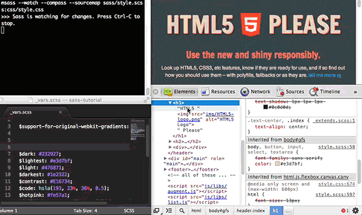

# Sass
### 1 Sass安装
#### 1.1 Mac安装
```
// 前提安装了ruby，检测
ruby －v
// gem仓库站点 https://rubygems.org
sudo gem install sass
// 如果被墙，可直接下载后再安装
sudo gem install path/sass-3.14.18.gem
// 检查安装版本
sass -v
```
#### 1.2 更新
```
gem update sass
```
#### 1.3 卸载
```
gem uninstall sass
```
#### 1.4 编译
##### 1.4.1 编译方式
* 命令编译

```
// 单文件编译
sass <path>/style.scss:<path>/style.css
// 多文件编译
sass <path>/sass/:<path>/css/
// sass --watch
sass --watch test.sass:test.css
sass --watch test.scss:test.css
```
* GUI工具编译
  * Koala (http://koala-app.com/)
  * Compass.app（http://compass.kkbox.com/）
  * Scout（http://mhs.github.io/scout-app/）
  * CodeKit（https://incident57.com/codekit/index.html）
  * Prepros（https://prepros.io/）
* 自动化编译
  * grunt
  * gulp

```
// 例子
// grunt
module.exports = function(grunt) {
    grunt.initConfig({
        pkg: grunt.file.readJSON('package.json'),
        sass: {
            dist: {
                files: {
                    'style/style.css' : 'sass/style.scss'
                }
            }
        },
        watch: {
            css: {
                files: '**/*.scss',
                tasks: ['sass']
            }
        }
    });
    grunt.loadNpmTasks('grunt-contrib-sass');
    grunt.loadNpmTasks('grunt-contrib-watch');
    grunt.registerTask('default',['watch']);
}

// gulp
var gulp = require('gulp');
var sass = require('gulp-sass');

gulp.task('sass', function () {
    gulp.src('./scss/*.scss')
        .pipe(sass())
        .pipe(gulp.dest('./css'));
});

gulp.task('watch', function() {
    gulp.watch('scss/*.scss', ['sass']);
});

gulp.task('default', ['sass','watch']);
```
##### 1.4.2 编译输出方式
* 嵌套输出方式 nested

```
sass --watch test.scss:test.css --style nested
```
* 展开输出方式 expanded

```
sass --watch test.scss:test.css --style expanded
```
* 紧凑输出方式 compact

```
sass --watch test.scss:test.css --style compact
```
* 压缩输出方式 compressed

```
sass --watch test.scss:test.css --style compressed
```

```
// 例子
// sass
nav {
    ul {
        margin: 0;
        padding: 0;
        list-style: none;
    }
    
    li { display: inline-block; }
    
    a {
        display: block;
        padding: 6px 12px;
        text-decoration: none;
    }
}

// nested
nav ul {
    margin: 0;
    padding: 0;
    list-style: none; }
nav li {
  display: inline-block; }
nav a {
    display: block;
    padding: 6px 12px;
    text-decoration: none; }

// expanded
nav ul {
    margin: 0;
    padding: 0;
    list-style: none;
}
nav li {
    display: inline-block;
}
nav a {
    display: block;
    padding: 6px 12px;
    text-decoration: none;
}

// compact
nav ul { margin: 0; padding: 0; list-style: none; }
nav li { display: inline-block; }
nav a { display: block; padding: 6px 12px; text-decoration: none; }

// compressed
nav ul{margin:0;padding:0;list-style:none}nav li{display:inline-block}nav a{display:block;padding:6px 12px;text-decoration:none}
```
#### 1.5 Sass调试
```
// 早期版本
sass --watch --scss --sourcemap style.scss:style.css
// Sass3.3 版本之上不需要添加 --sourcemap
sass --watch style.scss:style.css
```

### 2 Sass与Scss的区别
.sass只能使用Sass老语法规则（严格tab缩进规则，没看到类似 CSS 中的大括号和分号）

.scss使用的是Sass的新语法规则，也就是 SCSS 语法规则（类似 CSS 语法格式，代码都包裹在一对大括号里，并且末尾结束处都有一个分号）
```
// css样式
body {
    font: 100% Helvetica, sans-serif;
    color: #333;
}
```
```
// Sass实现
$font-stack: Helvetica, sans-serif
$primary-color: #333

body
    font: 100% $font-stack
    color: $primary-color
```
```
// Scss实现
$font-stack: Helvetica, sans-serif;
$primary-color: #333;

body {
    font: 100% $font-stack;
    color: $primary-color;
}
```
### 3 Sass教程(scss)
#### 3.1 变量
##### 3.1.1 声明变量
```
// 声明变量的符号“$”+变量名称:赋予变量的值;
$width: 200px;
// !default表示默认值
$color: #f00 !default;
// sass 的默认变量一般是用来设置默认值，然后根据需求来覆盖的，覆盖的方式也很简单，只需要在默认变量之前重新声明下变量即可。
$baseLineHeight: 2;
$baseLineHeight: 1.5 !default;
body{
    line-height: $baseLineHeight; 
}
```
##### 3.1.2 变量的调用
```
body {
    width: $width;
    color: $color;
    line-height: $baseLineHeight;
}
```
##### 3.1.3 变量的作用域
```
$color: orange !default;//定义全局变量(在选择器、函数、混合宏...的外面定义的变量为全局变量)
.block {
    color: $color;//调用全局变量
}
em {
    $color: red;//定义局部变量
    a {
        color: $color;//调用局部变量
    }
}
span {
    color: $color;//调用全局变量
}
```
#### 3.2 嵌套
##### 3.2.1 选择器嵌套
```
nav {
    a {
        color: red;
    
        header & {
            color:green;
        }
    }  
}
```
##### 3.2.2 属性嵌套
```
.box {
    border: {
        top: 1px solid red;
        bottom: 1px solid green;
    }
}
```
##### 3.2.3 伪类嵌套
```
.clearfix{
    &:before,
    &:after {
        content:"";
        display: table;
    }
    &:after {
        clear:both;
        overflow: hidden;
    }
}
```
#### 混合宏
1、声明混合宏
```
// 不带参数混合宏
@mixin border-radius{
    -webkit-border-radius: 5px;
    border-radius: 5px;
}
// 带参数混合宏
@mixin border-radius($radius:5px){
    -webkit-border-radius: $radius;
    border-radius: $radius;
}
// 复杂的混合宏
@mixin box-shadow($shadow...) {
    @if length($shadow) >= 1 {
        @include prefixer(box-shadow, $shadow);
    } @else{
        $shadow:0 0 4px rgba(0,0,0,.3);
        @include prefixer(box-shadow, $shadow);
    }
}
```
2、调用混合宏
```
@mixin border-radius{
    -webkit-border-radius: 3px;
    border-radius: 3px;
}
button {
    @include border-radius;
}
```
3、混合宏参数
```
// 传一个不带值的参数
@mixin border-radius($radius){
    -webkit-border-radius: $radius;
    border-radius: $radius;
}
.box {
    @include border-radius(3px);
}
// 传一个带值的参数
@mixin border-radius($radius:3px){
    -webkit-border-radius: $radius;
    border-radius: $radius;
}
.btn {
    @include border-radius;
}
// 传多个参数
@mixin center($width,$height){
    width: $width;
    height: $height;
    position: absolute;
    top: 50%;
    left: 50%;
    margin-top: -($height) / 2;
    margin-left: -($width) / 2;
}
.box-center {
    @include center(500px,300px);
}
// 特别的参数“…”
@mixin box-shadow($shadows...){
    @if length($shadows) >= 1 {
        -webkit-box-shadow: $shadows;
        box-shadow: $shadows;
    } @else {
        $shadows: 0 0 2px rgba(#000,.25);
        -webkit-box-shadow: $shadow;
        box-shadow: $shadow;
    }
}
.box {
    @include box-shadow(0 0 1px rgba(#000,.5),0 0 2px rgba(#000,.2));
}
```
#### 继承与扩展

```
.btn {
    border: 1px solid #ccc;
    padding: 6px 10px;
    font-size: 14px;
}

.btn-primary {
    background-color: #f36;
    color: #fff;
    @extend .btn;
}

.btn-second {
    background-color: orange;
    color: #fff;
    @extend .btn;
}
```
#### 占位符 %placeholder
```
%mt5 {
    margin-top: 5px;
}
%pt5{
    padding-top: 5px;
}

.btn {
    @extend %mt5;
    @extend %pt5;
}

.block {
    @extend %mt5;
    
    span {
        @extend %pt5;
    }
}
```
#### 混合宏 VS 继承 VS 占位符

#### 插值#{}
```
$properties: (margin, padding);
@mixin set-value($side, $value) {
    @each $prop in $properties {
        #{$prop}-#{$side}: $value;
    }
}
.login-box {
    @include set-value(top, 14px);
}
```
```
@mixin generate-sizes($class, $small, $medium, $big) {
    .#{$class}-small { font-size: $small; }
    .#{$class}-medium { font-size: $medium; }
    .#{$class}-big { font-size: $big; }
}
@include generate-sizes("header-text", 12px, 20px, 40px);
```
```
%updated-status {
    margin-top: 20px;
    background: #F00;
}
.selected-status {
    font-weight: bold;
}
$flag: "status";
.navigation {
    @extend %updated-#{$flag};
    @extend .selected-#{$flag};
}
```
#### 注释
* 类似 CSS 的注释方式，使用"/* ”开头，结属使用 ”*/"
* 类似 JavaScript 的注释方式，使用"//"

两者区别，前者会在编译出来的 CSS 显示，后者在编译出来的 CSS 中不会显示
#### 数据类型
* 数字：如，1、2、13、10px；
* 字符串：有引号字符串或无引号字符串，如，"foo"、'bar'、baz；
* 颜色：如，blue、#04a3f9、rgba(255,0,0,0.5)；
* 布尔型：如，true、false；
* 空值：如，null；
* 值列表：用空格或者逗号分开，如，1.5em 1em 0 2em 、Helvetica, Arial, sans-serif。
  * nth函数（nth function） 可以直接访问值列表中的某一项；
  * join函数（join function） 可以将多个值列表连结在一起；
  * append函数（append function） 可以在值列表中添加值； 
  * @each规则（@each rule） 则能够给值列表中的每个项目添加样式。

#### 运算
```
// 加法
.box {
    width: 20px + 8in;
}
// 减法
$full-width: 960px;
$sidebar-width: 200px;

.content {
    width: $full-width -  $sidebar-width;
}
// 乘法
.box {
    width:10px * 2;  
}
// 除法
// 如果数值或它的任意部分是存储在一个变量中或是函数的返回值。
// 如果数值被圆括号包围。
// 如果数值是另一个数学表达式的一部分。
// 如果两个值带有相同的单位值时，除法运算之后会得到一个不带单位的数值。
.box {
    width: (100px / 2);  
}
// 颜色运算
p {
    color: #010203 + #040506;
}
// 字符运算
$content: "Hello" + "" + "Sass!";
.box:before {
  content: " #{$content} ";
}

```
### Sass的控制命令
#### @if
```
@mixin blockOrHidden($boolean:true) {
  @if $boolean {
      @debug "$boolean is #{$boolean}";
      display: block;
    }
  @else {
      @debug "$boolean is #{$boolean}";
      display: none;
    }
}

.block {
  @include blockOrHidden;
}

.hidden{
  @include blockOrHidden(false);
}
```
#### @for
```
// $i:表示变量  start:表示起始值  end:表示结束值
// 关键字 through 表示包括 end 这个数，而 to 则不包括 end 这个数。
@for $i from <start> through <end>
@for $i from <start> to <end>
```
```
$grid-prefix: span !default;
$grid-width: 60px !default;
$grid-gutter: 20px !default;

%grid {
  float: left;
  margin-left: $grid-gutter / 2;
  margin-right: $grid-gutter / 2;
}
@for $i from 1 through 12 {
  .#{$grid-prefix}#{$i}{
    width: $grid-width * $i + $grid-gutter * ($i - 1);
    @extend %grid;
  }  
}
```
#### @while
```
$types: 4;
$type-width: 20px;

@while $types > 0 {
    .while-#{$types} {
        width: $type-width + $types;
    }
    $types: $types - 1;
}
```
#### @each
```
@each $var in <list>
```
```
$list: adam john wynn mason kuroir;//$list 就是一个列表

@mixin author-images {
    @each $author in $list {
        .photo-#{$author} {
            background: url("/images/avatars/#{$author}.png") no-repeat;
        }
    }
}

.author-bio {
    @include author-images;
}
```
### Sass的函数
#### 字符串函数
##### unquote() & quote()
```
// unquote($string)：删除字符串中的引号
// unquote( ) 函数只能删除字符串最前和最后的引号（双引号或单引号），而无法删除字符串中间的引号。如果字符没有带引号，返回的将是字符串本身。
.test1 {
    content:  unquote('Hello Sass!') ;
}
// quote($string)：给字符串添加引号
.test1 {
    content:  quote('Hello Sass!');
}
// 使用 quote() 函数只能给字符串增加双引号，而且字符串中间有单引号或者空格时，需要用单引号或双引号括起，否则编译的时候将会报错。解决方案就是去掉空格，或者加上引号。
// 同时 quote() 碰到特殊符号，比如： !、?、> 等，除中折号 - 和 下划线_ 都需要使用双引号括起，否则编译器在进行编译的时候同样会报错。
```
##### To-upper-case() & To-lower-case()
```
// To-upper-case() 函数将字符串小写字母转换成大写字母
.test {
  text: to-upper-case(aaaaa);
  text: to-upper-case(aA-aAAA-aaa);
}
// To-lower-case() 函数将字符串转换成小写字母
.test {
  text: to-lower-case(AAAAA);
  text: to-lower-case(aA-aAAA-aaa);
}
```
#### 数字函数
##### percentage()
```
// percentage($value)：将一个不带单位的数转换成百分比值
// 如果您转换的值是一个带有单位的值，那么在编译的时候会报错误信息
.footer{
    width : percentage(.2)
}
```
##### round()
```
// round() 函数可以将一个数四舍五入为一个最接近的整数
.footer {
   width:round(12.3px)
}
```
##### ceil()
```
// ceil() 函数将一个数转换成最接近于自己的整数，会将一个大于自身的任何小数转换成大于本身 1 的整数。也就是只做入，不做舍的计算。
.footer {
   width:ceil(12.3px);
}
```
##### floor()
```
// floor() 函数刚好与 ceil() 函数功能相反，其主要将一个数去除其小数部分，并且不做任何的进位。也就是只做舍，不做入的计算。
.footer {
   width:floor(12.3px);
}
```
##### abs()
```
// abs( ) 函数会返回一个数的绝对值。
.footer {
   width:abs(-12.3px);
}
```
##### min() & max()
```
// min() 函数功能主要是在多个数之中找到最小的一个，这个函数可以设置任意多个参数
// 在 min() 函数中同时出现两种不同类型的单位，将会报错误信息
>> min(1em,2em,6em)
1em
// max() 函数和 min() 函数一样，不同的是，max() 函数用来获取一系列数中的最大那个值
>> max(1px,5px)
5px
```
##### random()
```
// random() 函数是用来获取一个随机数
>> random()
```
#### 列表函数
##### length()
```
// ength() 函数主要用来返回一个列表中有几个值，简单点说就是返回列表清单中有多少个值
// length() 函数中的列表参数之间使用空格隔开，不能使用逗号，否则函数将会出错
>> length(10px 20px (border 1px solid) 2em)
4
```
##### nth()
```
nth($list,$n)
// nth() 函数用来指定列表中某个位置的值。不过在 Sass 中，nth() 函数和其他语言不同，1 是指列表中的第一个标签值，2 是指列给中的第二个标签值，依此类推。
>> nth(10px 20px 30px,1)
10px
```
##### join()
```
// join() 函数是将两个列表连接合并成一个列表
// join() 只能将两个列表连接成一个列表，如果直接连接两个以上的列表将会报错
>> join(10px 20px, 30px 40px)
(10px 20px 30px 40px)
>> join((blue red), join((#abc #def),(#dee #eff)))
(#0000ff #ff0000 #aabbcc #ddeeff #ddeeee #eeffff)
// 参数 $separator主要是用来给列表函数连接列表值是，使用的分隔符号，默认值为 auto，还有 comma 和 space 两个值
>> join(blue,red,comma)
(#0000ff, #ff0000)
```
##### append()
```
// append() 函数是用来将某个值插入到列表中，并且处于最末位
>> append(10px 20px ,30px)
(10px 20px 30px)
// 在 append() 函数中，可以显示的设置 $separator 参数
>> append((blue green),red,comma)
(#0000ff, #008000, #ff0000)
```
##### zip()
```
// zip()函数将多个列表值转成一个多维的列表
// 在使用zip()函数时，每个单一的列表个数值必须是相同的
>> zip(1px 2px 3px,solid dashed dotted,green blue red)
((1px "solid" #008000), (2px "dashed" #0000ff), (3px "dotted" #ff0000))
```
##### index()
```
// ndex() 函数类似于索引一样，主要让你找到某个值在列表中所处的位置。在 Sass 中，第一个值就是1，第二个值就是 2，依此类推
>> index(1px solid red,dotted) //列表中没有找到 dotted
false
>> index(1px solid red,solid) //列表中找到 solid 值，并且返回他的位置值 2
2
```
##### Introspection
```
// type-of() 函数主要用来判断一个值是属于什么类型
>> type-of(100)
"number"
>> type-of("asdf")
"string"
>> type-of(true)
"bool"
>> type-of(#fff)
"color"
>> type-of(1 / 2 = 1)
"string"
// unit() 函数主要是用来获取一个值所使用的单位，碰到复杂的计算时，其能根据运算得到一个“多单位组合”的值，不过只允许乘、除运算；但加、减碰到不同单位时，unit() 函数将会报错，除 px 与 cm、mm 运算之外
>> unit(100)
""
>> unit(100px)
"px"
>> unit(20%)
"%"
>> unit(1em)
"em"
>> unit(10px * 3em)
"em*px"
>> unit(10px / 3em)
"px/em"
// unitless() 函数相对来说简单明了些，只是用来判断一个值是否带有单位，如果不带单位返回的值为 true，带单位返回的值为 false
>> unitless(100)
true
>> unitless(100px)
false
>> unitless(100em)
false
>> unitless(100%)
false
>> unitless(1 /2 )
true
// comparable() 函数主要是用来判断两个数是否可以进行“加，减”以及“合并”。如果可以返回的值为 true，如果不可以返回的值是 false
>> comparable(2px,1px)
true
>> comparable(2px,1%)
false
>> comparable(2px,1em)
false
```
##### Miscellaneous
```
// 在这里把 Miscellaneous 函数称为三元条件函数，主要因为他和 JavaScript 中的三元判断非常的相似。他有两个值，当条件成立返回一种值，当条件不成立时返回另一种值
if($condition,$if-true,$if-false)
>> if(true,1px,2px)
1px
>> if(false,1px,2px)
2px
```
##### Map
```
// Sass 的 map 常常被称为数据地图，也有人称其为数组，因为他总是以 key:value 成对的出现，但其更像是一个 JSON 数据。
$map: (
    $key1: value1,
    $key2: value2,
    $key3: value3
)
$map: (
    key1: value1,
    key2: (
        key-1: value-1,
        key-2: value-2,
    ),
    key3: value3
);
// map-get($map,$key) 函数的作用是根据 $key 参数，返回 $key 在 $map 中对应的 value 值。如果 $key 不存在 $map中，将返回 null 值。
$social-colors: (
    dribble: #ea4c89,
    facebook: #3b5998,
    github: #171515,
    google: #db4437,
    twitter: #55acee
);
.btn-dribble{
  color: map-get($social-colors,facebook);
}
// map-has-key($map,$key) 函数将返回一个布尔值。当 $map 中有这个 $key，则函数返回 true，否则返回 false。
@if map-has-key($social-colors,faceboo){
    .btn-facebook {
        color: map-get($social-colors,facebook);
    }
} @else {
    @warn "No color found for faceboo in $social-colors map. Property ommitted."
}
// map-keys($map) 函数将会返回 $map 中的所有 key。这些值赋予给一个变量，那他就是一个列表。
>> map-keys($social-colors);
"dribble","facebook","github","google","twitter"
@function colors($color){
    $names: map-keys($social-colors);
    @if not index($names,$color){
        @warn "Waring: `#{$color} is not a valid color name.`";
    }
    @return map-get($social-colors,$color);
}
// map-values($map) 函数类似于 map-keys($map) 功能，不同的是 map-values($map )获取的是 $map 的所有 value 值，可以说也将是一个列表。而且，map-values($map) 中如果有相同的 value 也将会全部获取出来。
>> map-values($social-colors)
#ea4c89,#3b5998,#171515,#db4437,#55acee
// map-merge($map1,$map2) 函数是将 $map1 和 $map2 合并，然后得到一个新的 $map。如果你要快速将新的值插入到 $map 中的话，这种方法是最佳方法。
map-merge($map1,$map2)
$color: (
    text: #f36,
    link: #f63,
    border: #ddd,
    backround: #fff
);
$typo:(
    font-size: 12px,
    line-height: 1.6,
    border: #ccc,
    background: #000
);
$newmap: map-merge($color,$typo);
// map-remove($map,$key) 函数是用来删除当前 $map 中的某一个 $key，从而得到一个新的 map。其返回的值还是一个 map。他并不能直接从一个 map 中删除另一个 map，仅能通过删除 map 中的某个 key 得到新 map。
$map:map-remove($social-colors,dribble);
// keywords($args) 函数可以说是一个动态创建 map 的函数。可以通过混合宏或函数的参数变创建 map。参数也是成对出现，其中 $args 变成 key(会自动去掉$符号)，而 $args 对应的值就是value。
@mixin map($args...){
    @debug keywords($args);
}

@include map(
  $dribble: #ea4c89,
  $facebook: #3b5998,
  $github: #171515,
  $google: #db4437,
  $twitter: #55acee
);
```
#### 颜色函数
##### RGB()
```
// RGB颜色只是颜色中的一种表达式，其中 R 是 red 表示红色，G 是 green 表示绿色而 B 是 blue 表示蓝色。
rgb($red,$green,$blue)
// rgba() 函数主要用来将一个颜色根据透明度转换成 rgba 颜色
rgba($red,$green,$blue,$alpha)  //将一个rgba颜色转译出来，和未转译的值一样
rgba($color,$alpha)  //将一个Hex颜色转换成rgba颜色
// red() 函数非常简单，其主要用来获取一个颜色当中的红色值。假设有一个 #f36 的颜色，如果你想得到 #f36 中的 red 值是多少，这个时候使用 red() 函数就能很简单获取。
>> red(#f36)
255
// green() 函数和 red() 函数一样，用来获取某一个颜色值中 green 的值。
// blue() 函数是用来获取某一个颜色值中 blue 的值
// Mix 函数是将两种颜色根据一定的比例混合在一起，生成另一种颜色。
mix($color-1,$color-2,$weight);
```
##### HSL
```
// hsl($hue,$saturation,$lightness)：通过色相（hue）、饱和度(saturation)和亮度（lightness）的值创建一个颜色；
// hsla($hue,$saturation,$lightness,$alpha)：通过色相（hue）、饱和度(saturation)、亮度（lightness）和透明（alpha）的值创建一个颜色；
// hue($color)：从一个颜色中获取色相（hue）值；
// saturation($color)：从一个颜色中获取饱和度（saturation）值；
// lightness($color)：从一个颜色中获取亮度（lightness）值；
// adjust-hue($color,$degrees)：通过改变一个颜色的色相值，创建一个新的颜色；
$baseColor: #ad141e;
.adjust-hue-deg {
  background: adjust-hue($baseColor,30deg);
}
.adjust-hue-per {
  background: adjust-hue($baseColor,30%);
}
// lighten($color,$amount)：通过改变颜色的亮度值，让颜色变亮，创建一个新的颜色；
// darken($color,$amount)：通过改变颜色的亮度值，让颜色变暗，创建一个新的颜色；
.lighten {
    background: lighten($baseColor,10%);
}
.darken{
    background: darken($baseColor,10%);
}
// saturate($color,$amount)：通过改变颜色的饱和度值，让颜色更饱和，从而创建一个新的颜色
// desaturate($color,$amount)：通过改变颜色的饱和度值，让颜色更少的饱和，从而创建出一个新的颜色；
$baseColor: #ad141e;
.saturate {
  background: saturate($baseColor,30%); //在原色饱和度基础上增加饱和度
}
.desaturate {
  background: desaturate($baseColor,30%);//在原色饱和度基础上减少饱和度
}
// grayscale($color)：将一个颜色变成灰色，相当于desaturate($color,100%);
$baseColor: #ad141e;
.grayscale {
  background: grayscale($baseColor);
}
.desaturate {
  background: desaturate($baseColor,100%);
}
// complement($color)：返回一个补充色，相当于adjust-hue($color,180deg);
// invert($color)：反回一个反相色，红、绿、蓝色值倒过来，而透明度不变。
```
##### Opacity
```
// alpha($color)/opacity($color)：获取颜色透明度值；
>> alpha(red)
1
>> alpha(rgba(red,.8))
0.8
>> opacity(red)
1
>> opacity(rgba(red,.8))
0.8
// rgba($color, $alpha)：改变颜色的透明度值；
>> rgba(red,.5)
rgba(255, 0, 0, 0.5)
>> rgba(#dedede,.5)
rgba(222, 222, 222, 0.5)
// opacify($color, $amount) / fade-in($color, $amount)：使颜色更不透明；fade-in() 函数又名 fade_in() 函数
>> opacify(rgba(22,34,235,.6),.2)
rgba(22, 34, 235, 0.8)
>> fade-in(rgba(23,34,34,.5),.15)
rgba(23, 34, 34, 0.65)
// transparentize($color, $amount) / fade-out($color, $amount)：使颜色更加透明
>> transparentize(red,.5)
rgba(255, 0, 0, 0.5)
>> fade-out(hsla(98,6%,23%,.5),.1)
rgba(58, 62, 55, 0.4)
```
#### 自定义函数
### @规则指令（directives）
#### @import
@import 根据文件名引入。 默认情况下，它会寻找 Sass 文件并直接引入， 但是，在少数几种情况下，它会被编译成 CSS 的 @import 规则：

* 如果文件的扩展名是 .css。
* 如果文件名以 http:// 开头。
* 如果文件名是 url()。
* 如果 @import 包含了任何媒体查询（media queries）。
```
@import "foo.css";
@import "foo" screen;
@import "http://foo.com/bar";
@import url(foo);
```

如果上述情况都没有出现，并且扩展名是 .scss 或 .sass， 该名称的 Sass 或 SCSS 文件就会被引入。 如果没有扩展名， Sass 将试着找出具有 .scss 或 .sass 扩展名的同名文件并将其引入。
```
@import "rounded-corners", "text-shadow";
.example {
  color: red;
}
#main {
  @import "example";
}
```
#### @media
Sass 中的 @media 指令和 CSS 的使用规则一样的简单，但它有另外一个功能，可以嵌套在 CSS 规则中。有点类似 JS 的冒泡功能一样，如果在样式中使用 @media 指令，它将冒泡到外面。
```
.sidebar {
  width: 300px;
  @media screen and (orientation: landscape) {
    width: 500px;
  }
}
```
@media 也可以嵌套 @media
```
@media screen {
  .sidebar {
    @media (orientation: landscape) {
      width: 500px;
    }
  }
}
```
在使用 @media 时，还可以使用插件#{}
```
$media: screen;
$feature: -webkit-min-device-pixel-ratio;
$value: 1.5;

@media #{$media} and ($feature: $value) {
  .sidebar {
    width: 500px;
  }
}
```
#### @extend
Sass 中的 @extend 是用来扩展选择器或占位符
```
.error {
  border: 1px #f00;
  background-color: #fdd;
}
.error.intrusion {
  background-image: url("/image/hacked.png");
}
.seriousError {
  @extend .error;
  border-width: 3px;
}
// 所设某个样式要继承多个地方的样式，那么可以使用 @extend 来继承多个选择器或占位符的样式
.error {
  border: 1px #f00;
  background-color: #fdd;
}
.attention {
  font-size: 3em;
  background-color: #ff0;
}
.seriousError {
  @extend .error;
  @extend .attention;
  border-width: 3px;
}
// 扩展单一选择器，这段代码在不调用之前不产生任何代码，只有能过@extend调用之后才生成代码
#context a%extreme {
  color: blue;
  font-weight: bold;
  font-size: 2em;
}
.notice {
  @extend %extreme;
}
```
#### @at-root
@at-root 从字面上解释就是跳出根元素。当你选择器嵌套多层之后，想让某个选择器跳出，此时就可以使用 @at-root。
```
.a {
  color: red;

  .b {
    color: orange;

    .c {
      color: yellow;

      @at-root .d {
        color: green;
      }
    }
  }  
}
```
#### @debug
@debug 在 Sass 中是用来调试的，当你的在 Sass 的源码中使用了 @debug 指令之后，Sass 代码在编译出错时，在命令终端会输出你设置的提示 Bug
```
@debug 10em + 12em;
```
#### @warn
@warn 和 @debug 功能类似，用来帮助我们更好的调试 Sass。
```
@mixin adjust-location($x, $y) {
  @if unitless($x) {
    @warn "Assuming #{$x} to be in pixels";
    $x: 1px * $x;
  }
  @if unitless($y) {
    @warn "Assuming #{$y} to be in pixels";
    $y: 1px * $y;
  }
  position: relative; left: $x; top: $y;
}
```
#### @error
@error 和 @warn、@debug 功能是如出一辙。
```
@mixin error($x){
  @if $x < 10 {
    width: $x * 10px;
  } @else if $x == 10 {
    width: $x;
  } @else {
    @error "你需要将#{$x}值设置在10以内的数";
  }

}

.test {
  @include error(15);
}
```